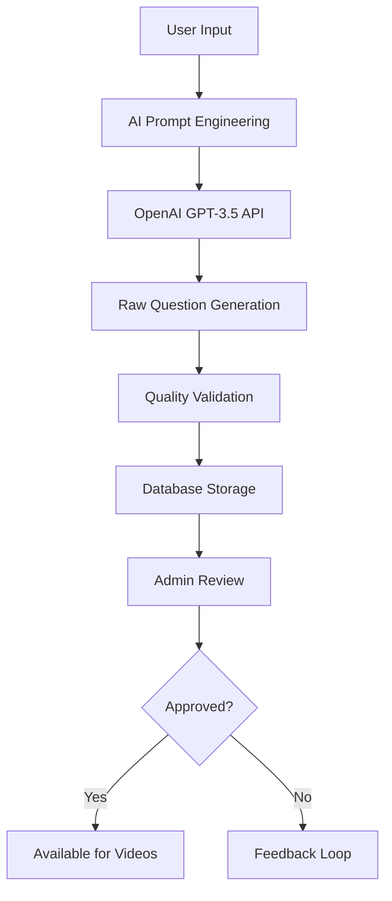
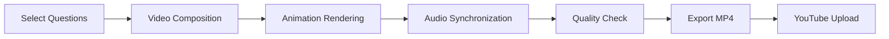

# Quiz Video Generator - Complete Application Documentation

## 🎯 Project Overview

### Mission Statement
**"Creating engaging, psychology-based quiz videos for Indian students (Classes 9-12) to enhance learning through AI-powered content generation and professional video production optimized for YouTube Shorts."**

### Core Value Proposition
- **AI-Powered Learning**: Generate syllabus-based questions using advanced AI
- **Professional Video Production**: Create engaging YouTube Shorts with animations and audio
- **Complete Workflow**: From question generation to YouTube upload in one platform
- **Educational Impact**: Improve student engagement and learning outcomes through gamified content

## 🏗️ System Architecture

### Technology Stack

#### Frontend & Backend
- **Framework**: Next.js 15 (App Router) with TypeScript
- **Styling**: TailwindCSS 4.0
- **State Management**: React Server Components + Client Components
- **Authentication**: NextAuth.js with role-based access control

#### Database & API
- **Database**: PostgreSQL with Prisma ORM
- **API Routes**: RESTful endpoints with Next.js API Routes
- **External APIs**:
  - OpenAI API (GPT-3.5-turbo) for question generation
  - YouTube Data API v3 for video uploads
  - Google OAuth 2.0 for authentication

#### Video Generation
- **Engine**: Remotion 4.0 (React-based video rendering)
- **Compositions**: Modular React components for video elements
- **Audio System**: Synchronized audio with visual animations
- **Output**: MP4 videos optimized for YouTube Shorts (9:16 aspect ratio)

### Application Structure

```
📦 Quiz Video Generator
├── 🎨 Frontend (Next.js)
│   ├── 🏠 Landing Pages
│   ├── 🔐 Authentication System
│   ├── 📊 Admin Dashboard
│   └── 🎬 Video Preview
├── 🔧 Backend APIs
│   ├── 📚 Content Management (Classes, Subjects, Topics)
│   ├── ❓ Question Generation & Management
│   ├── 🎥 Video Generation & Processing
│   └── 📤 YouTube Integration
├── 🎬 Video System (Remotion)
│   ├── 📝 Quiz Question Component
│   ├── ✅ Answer Reveal Component
│   └── 🎵 Audio-Visual Synchronization
├── 🗄️ Database (PostgreSQL + Prisma)
│   ├── 👥 Users & Authentication
│   ├── 📖 Educational Content
│   ├── ❓ Questions & Answers
│   └── 🎥 Videos & Metadata
└── 🔊 Audio Assets
    ├── ⏰ Timer Sounds
    ├── 🎉 Celebration Effects
    └── 🎵 Background Music
```

## 🎯 Core Features

### 1. Educational Content Management

#### Hierarchical Structure
```
Classes (9-12)
├── Subjects (Physics, Chemistry, Biology, Mathematics)
    └── Topics (Motion, Chemical Bonding, Cell Structure, etc.)
```

#### Content Features
- **CBSE Curriculum Aligned**: Complete syllabus coverage
- **Difficulty Levels**: Easy, Medium, Hard categorization
- **Question Types**: Multiple choice with explanations
- **AI Generation**: Context-aware question creation
- **Quality Control**: Admin approval/rejection system

### 2. AI-Powered Question Generation

#### Generation Process


#### AI Features
- **Context Awareness**: Subject and topic-specific questions
- **Syllabus Alignment**: CBSE curriculum compliance
- **Variety**: Different question patterns and difficulties
- **Explanations**: Detailed answer explanations
- **Quality Metrics**: Relevance and accuracy scoring

### 3. Video Generation System

#### Production Pipeline


#### Video Components
- **QuizQuestion.tsx**: Main question display with timer
- **QuizAnswer.tsx**: Answer reveal with explanations
- **QuizVideo.tsx**: Complete video composition

#### Animation Features
- **Entrance Effects**: Smooth slide-in animations
- **Timer System**: Pulsing countdown with audio
- **Answer Reveals**: Glowing effects and confetti
- **Psychology-Based**: Attention-grabbing design

### 4. YouTube Integration

#### Upload Process
- **Authentication**: OAuth 2.0 with refresh tokens
- **Metadata**: Auto-generated titles, descriptions, tags
- **Thumbnails**: Custom thumbnail generation
- **Analytics**: Upload tracking and performance monitoring
- **Batch Operations**: Multiple video uploads

#### SEO Optimization
- **Titles**: Subject + Topic + Question focus
- **Descriptions**: Educational value proposition
- **Tags**: CBSE, Class, Subject, Topic keywords
- **Playlists**: Organized by class and subject

## 🗄️ Database Schema

### Core Entities

#### Users
```sql
users (
  id: UUID PRIMARY KEY,
  email: VARCHAR UNIQUE,
  name: VARCHAR,
  role: ENUM('admin', 'user'),
  created_at: TIMESTAMP,
  updated_at: TIMESTAMP
)
```

#### Educational Content
```sql
classes (
  id: UUID PRIMARY KEY,
  name: VARCHAR,
  grade: INTEGER,
  created_at: TIMESTAMP
)

subjects (
  id: UUID PRIMARY KEY,
  name: VARCHAR,
  class_id: UUID FOREIGN KEY,
  created_at: TIMESTAMP
)

topics (
  id: UUID PRIMARY KEY,
  name: VARCHAR,
  subject_id: UUID FOREIGN KEY,
  created_at: TIMESTAMP
)
```

#### Questions
```sql
questions (
  id: UUID PRIMARY KEY,
  text: TEXT,
  option_a: VARCHAR,
  option_b: VARCHAR,
  option_c: VARCHAR,
  option_d: VARCHAR,
  correct_answer: ENUM('A', 'B', 'C', 'D'),
  explanation: TEXT,
  difficulty: ENUM('easy', 'medium', 'hard'),
  status: ENUM('pending', 'approved', 'rejected'),
  class_id: UUID,
  subject_id: UUID,
  topic_id: UUID,
  created_by_ai: BOOLEAN,
  created_at: TIMESTAMP,
  updated_at: TIMESTAMP
)
```

#### Videos
```sql
videos (
  id: UUID PRIMARY KEY,
  title: VARCHAR,
  description: TEXT,
  youtube_id: VARCHAR,
  status: ENUM('generating', 'ready', 'uploaded', 'failed'),
  file_path: VARCHAR,
  duration: INTEGER,
  question_ids: JSON,
  created_at: TIMESTAMP,
  updated_at: TIMESTAMP
)
```

## 🔐 Security & Authentication

### Authentication System
- **NextAuth.js**: Industry-standard authentication
- **OAuth Providers**: Google, GitHub support
- **Role-Based Access**: Admin vs User permissions
- **Session Management**: Secure JWT tokens

### Authorization Matrix
| Feature | Admin | User |
|---------|-------|------|
| Dashboard Access | ✅ | ❌ |
| Question Management | ✅ | ❌ |
| Video Generation | ✅ | ❌ |
| YouTube Upload | ✅ | ❌ |
| Content Viewing | ✅ | ✅ |

### Security Measures
- **Input Validation**: Server-side validation for all inputs
- **SQL Injection Protection**: Prisma ORM parameterized queries
- **XSS Prevention**: React's built-in XSS protection
- **CORS Configuration**: Proper cross-origin policies
- **Rate Limiting**: API endpoint rate limiting

## 🚀 Deployment & DevOps

### Development Environment
- **Local Development**: Next.js dev server with Turbopack
- **Database**: Local PostgreSQL with Prisma migrations
- **Video Development**: Remotion Studio for composition testing
- **Hot Reload**: Instant updates during development

### Production Deployment
- **Platform**: Vercel (recommended) or manual hosting
- **Database**: Supabase or Railway for PostgreSQL
- **Environment Variables**: Secure configuration management
- **CI/CD**: Automated testing and deployment

### Monitoring & Analytics
- **Error Tracking**: Comprehensive error logging
- **Performance Monitoring**: Video generation and upload metrics
- **User Analytics**: Dashboard usage and content generation stats
- **YouTube Analytics**: Video performance tracking

## 📊 Performance Optimization

### Frontend Performance
- **Code Splitting**: Route-based code splitting
- **Image Optimization**: Next.js Image component
- **Bundle Analysis**: Webpack bundle optimization
- **Caching**: React Query for data caching

### Video Generation Performance
- **Parallel Processing**: Batch video generation
- **Asset Optimization**: Compressed audio/video files
- **Memory Management**: Efficient resource usage
- **Queue System**: Background job processing

### Database Performance
- **Indexing**: Optimized database indexes
- **Query Optimization**: Efficient Prisma queries
- **Connection Pooling**: Database connection management
- **Caching**: Redis for frequently accessed data

## 🔧 Development Workflow

### Git Workflow
```
main (production)
├── develop (staging)
    ├── feature/quiz-generation
    ├── feature/video-improvements
    └── feature/ui-enhancements
```

### Code Quality
- **TypeScript**: Strict type checking
- **ESLint**: Code linting and formatting
- **Prettier**: Code formatting consistency
- **Testing**: Unit and integration tests

### Documentation
- **README.md**: Project overview and setup
- **API Documentation**: OpenAPI/Swagger documentation
- **Component Documentation**: Storybook for UI components
- **Architecture Decisions**: ADR (Architecture Decision Records)

## 🎯 User Experience

### Target Audience
- **Primary**: Indian students (Classes 9-12)
- **Secondary**: Teachers and educational content creators
- **Tertiary**: Parents monitoring student progress

### User Journey
1. **Discovery**: Find quiz videos on YouTube
2. **Engagement**: Watch interactive quiz content
3. **Learning**: Understand concepts through explanations
4. **Retention**: Subscribe for more educational content

### Admin Journey
1. **Setup**: Configure classes, subjects, and topics
2. **Content Creation**: Generate and approve questions
3. **Video Production**: Create and upload quiz videos
4. **Performance Monitoring**: Track video analytics

## 🔮 Future Roadmap

### Phase 1 (Current)
- ✅ Complete video generation system
- ✅ AI question generation
- ✅ YouTube integration
- ✅ Admin dashboard

### Phase 2 (Next 3 months)
- [ ] Advanced analytics dashboard
- [ ] Mobile app for students
- [ ] Social sharing features
- [ ] Multi-language support

### Phase 3 (Next 6 months)
- [ ] Live quiz sessions
- [ ] Student progress tracking
- [ ] Teacher collaboration tools
- [ ] Advanced AI features

### Phase 4 (Next year)
- [ ] VR/AR integration
- [ ] Gamification system
- [ ] AI tutoring assistant
- [ ] International curriculum support

## 🤝 Contributing

### Development Setup
1. Fork the repository
2. Set up local development environment
3. Create feature branch
4. Implement changes with tests
5. Submit pull request

### Code Standards
- **Commits**: Conventional commit format
- **PRs**: Detailed description with screenshots
- **Reviews**: At least one approval required
- **Testing**: All features must have tests

### Community Guidelines
- **Issues**: Use issue templates
- **Discussions**: GitHub Discussions for questions
- **Documentation**: Update docs for new features
- **Backwards Compatibility**: Maintain API compatibility

## 📞 Support & Contact

### Getting Help
- **Documentation**: Comprehensive docs in `/docs`
- **Issues**: Bug reports and feature requests
- **Discussions**: Community questions and answers
- **Email**: Direct support for critical issues

### Training & Resources
- **Video Tutorials**: Step-by-step setup guides
- **API Documentation**: Complete API reference
- **Best Practices**: Development guidelines
- **Troubleshooting**: Common issues and solutions

---

**Built with ❤️ for transforming education through technology**

*This application represents a complete ecosystem for creating engaging educational content, from AI-powered question generation to professional video production and distribution.*
